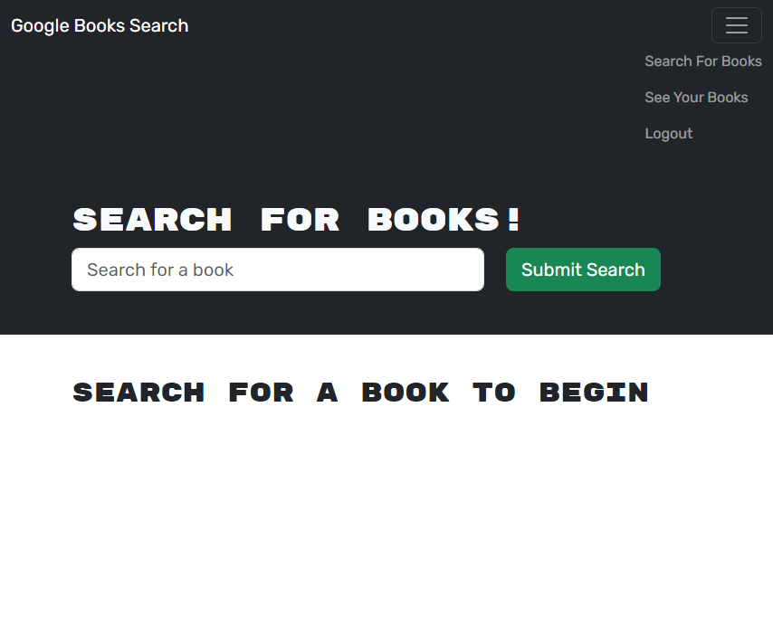

# MERN-Book-Search

## Description
This assignment allows users to create an account, log in, and search for books. Users can save books to their account and also delete them. The assignment uses a graphQL api and MERN stack and was a good way to apply what we learned in class about these topics.

## License
MIT

## Credits
I used the MERN module in the class repository as an example which helped me understand how to refactor the code.
I also used the source code from https://github.com/coding-boot-camp/solid-broccoli

## Screenshot
